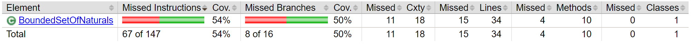
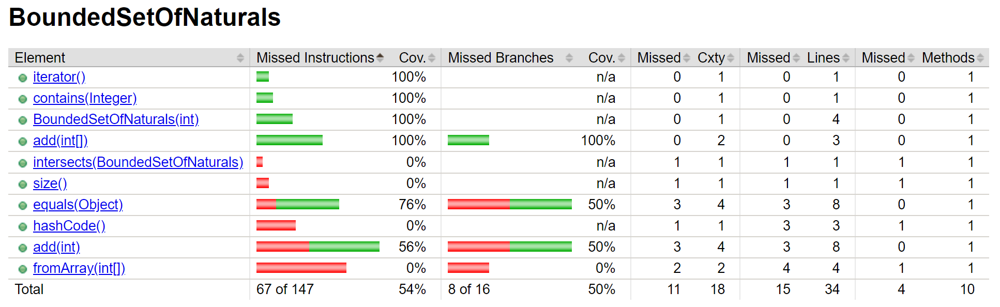
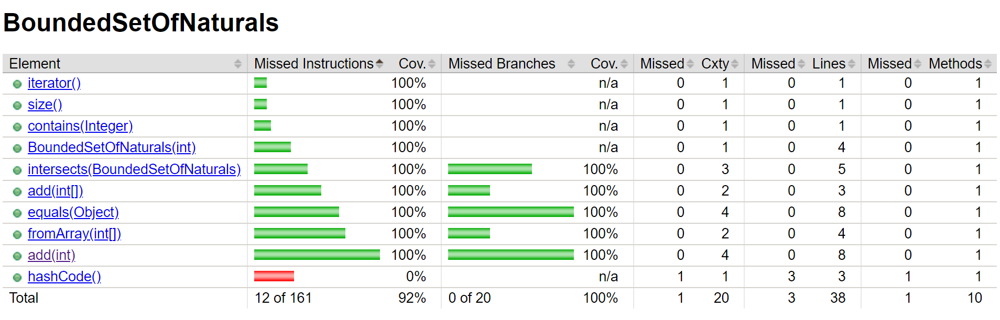

# 1.2  2c

The HTML report isnt under target/jacoco but target/site/jacoco.

Here is the coverage of BoundedSetOfNaturals.

Implemented unit test for:
- More complete add
- Intersects
- Equals
- Enabled from bad array test

Coverage after:

