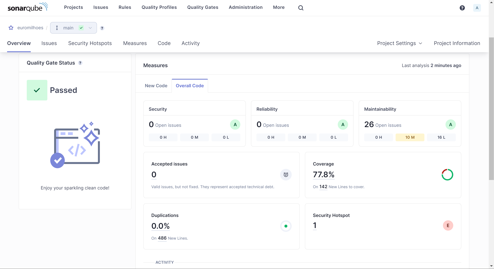
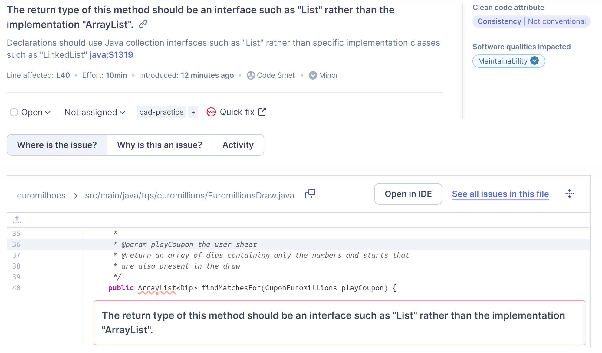
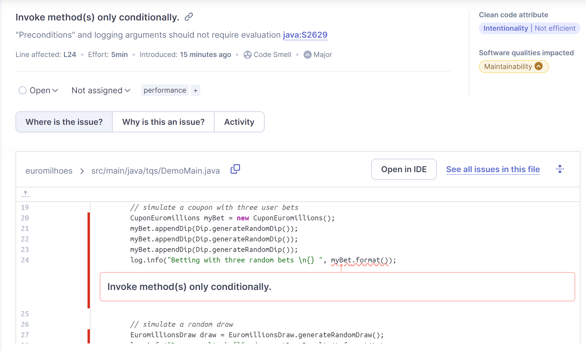
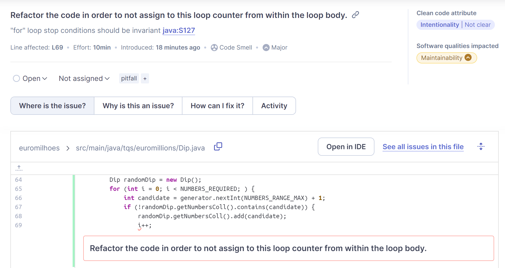
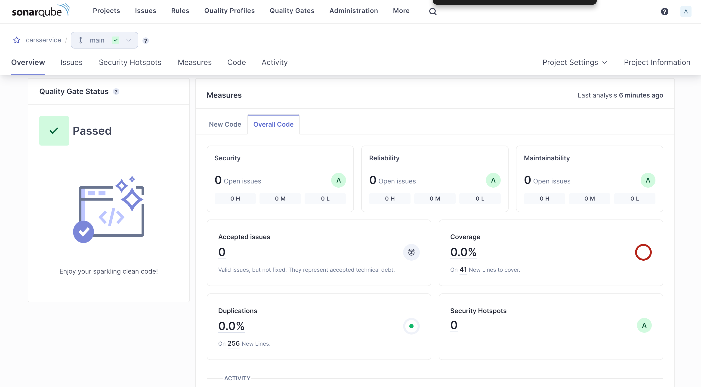
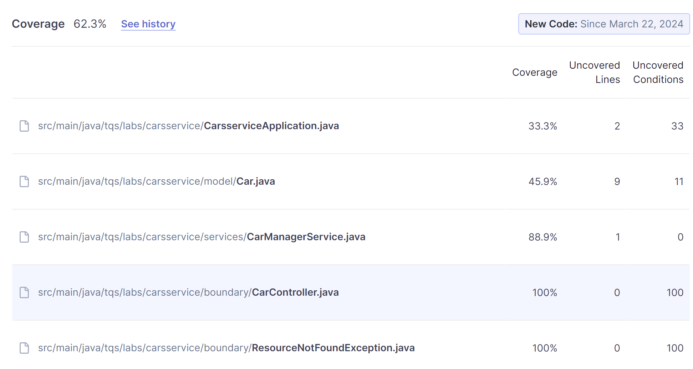
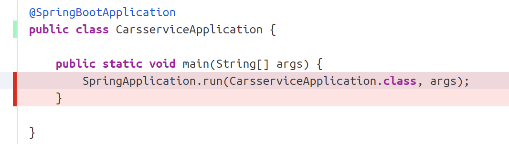
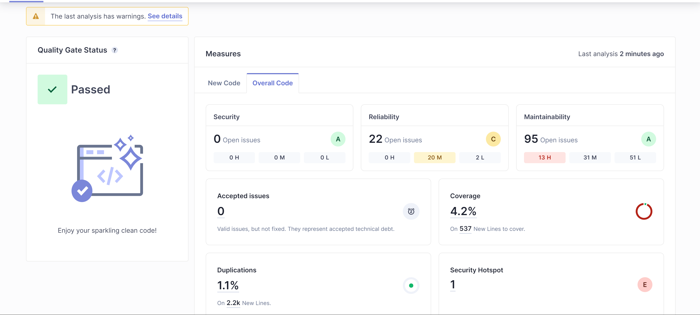
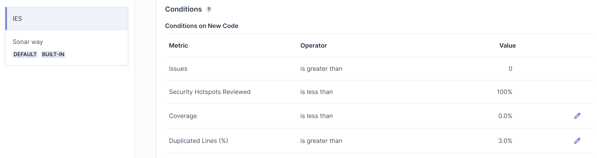

# LAB 6 1

## e)

The project passed the quality gate as shown by 

## f)

| Issue         | Problem description | How to solve |
|---            |---                  |---           |
| Clean code    | The return type of this method should be an interface such as "List" rather than the implementation "ArrayList".                    | Declarations should use Java collection interfaces such as "List" rather than specific implementation classes             |

| Issue         | Problem description | How to solve |
|---            |---                  |---           |
| Maintainability          |  "Preconditions" and logging arguments should not require evaluation                   | Invoke method(s) only conditionally.             |

| Issue         | Problem description | How to solve |
|---            |---                  |---           |
| Maintainability          |  "for" loop stop conditions should be invariant                  | Refactor the code in order to not assign to this loop counter from within the loop body.             |

# Lab 6 2 

## a)

Technical debt is the amount of time required to solve a certain issue. Since I dont have issues this is 0.

## c)

The values are good , most of the classes with low coverage are due to them only being used by Springboot and not tested directly on tests. Ex:

# Lab 6 3

For this exercise I used the ies project.

## a)

Running sonarqube on the project i get this overall evaluation.

The new quality gate I made is very similar to the default one but I took out the code coverage since this project didn't have any tests. I felt this was the only change required to the quality gate in order to still obey clean code guidelines.

